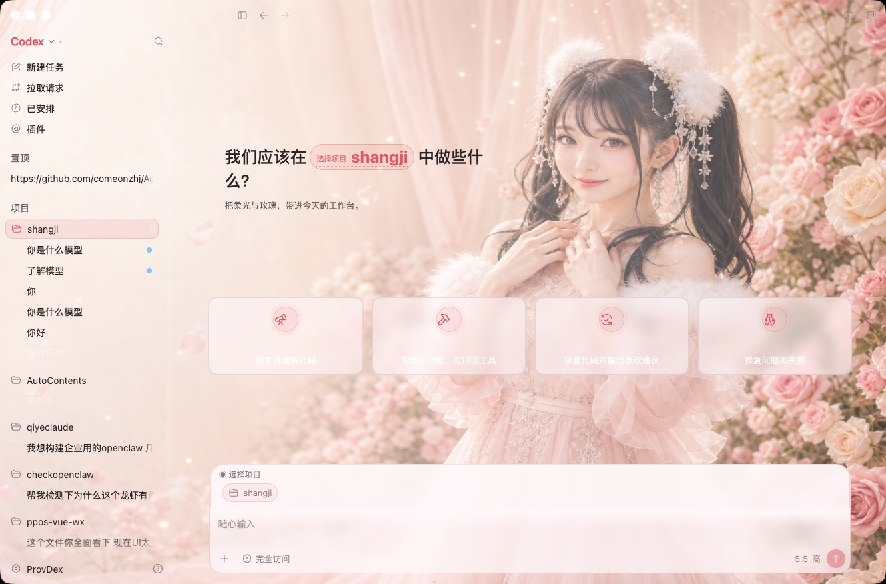

<p align="center">
  
</p>

<h1 align="center">agent-skin-hub</h1>

<p align="center">
  <strong>给 Codex 换一套好看的皮肤。</strong><br/>
  免费 · 开源 · 一键装上
</p>

<p align="center">
  <a href="https://github.com/Chiody/agent-skin-hub/stargazers"></a>
  <a href="./LICENSE"></a>
</p>

---

写代码已经够累了。工作台，至少可以好看一点。

用 [ProvDex](https://provdex.com) 打开就能换，不用改 Codex 本体。

---

## 试装（当前最新）

按对照仓开源提示词生成 · 当前 Codex 首页实拍（四张原生建议卡）

| 试装 | 文件夹 | 预览 |
|------|--------|------|
| 柔光玫瑰 | [`presets/preset-trial-rose-soft`](./presets/preset-trial-rose-soft) | [截图](./docs/previews/preset-trial-rose-soft.jpg) |
| 财神打工 | [`presets/preset-trial-caishen`](./presets/preset-trial-caishen) | [截图](./docs/previews/preset-trial-caishen.jpg) |

<p align="center">
  <br/>
  <sub>试装 · 柔光玫瑰</sub>
</p>

<p align="center">
  <br/>
  <sub>试装 · 财神打工</sub>
</p>

本机切换（已装换肤注入时）：

```bash
~/.codex/codex-dream-skin-studio/scripts/switch-theme-macos.sh --id preset-trial-rose-soft
~/.codex/codex-dream-skin-studio/scripts/switch-theme-macos.sh --id preset-trial-caishen
```

---

## 怎么用

1. 打开 [ProvDex](https://provdex.com)
2. 进 Codex → **外观**
3. 挑一套，点应用

更多：[Skin Hub](https://provdex.com/skinhub.html)

---

## 还有哪些

| 名字 | 目录 |
|------|------|
| 星莓绮梦 / 苍蓝矩阵 / 雪景 / … | [`presets/`](./presets/) |
| 完整目录 | [`catalog.json`](./catalog.json) |

---

## 想投稿？

```text
presets/preset-your-slug/
  theme.json
  background.jpg   ← 纯背景，别拿整页 UI 截图凑数
  SOURCE.md
```

**别投：** 游戏角色、真人明星脸、带侧栏输入框的假截图。

---

## License

MIT。每套皮肤看各自的 `SOURCE.md`。
