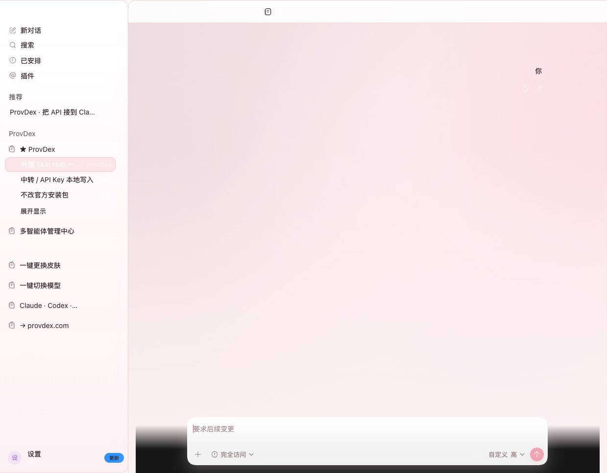
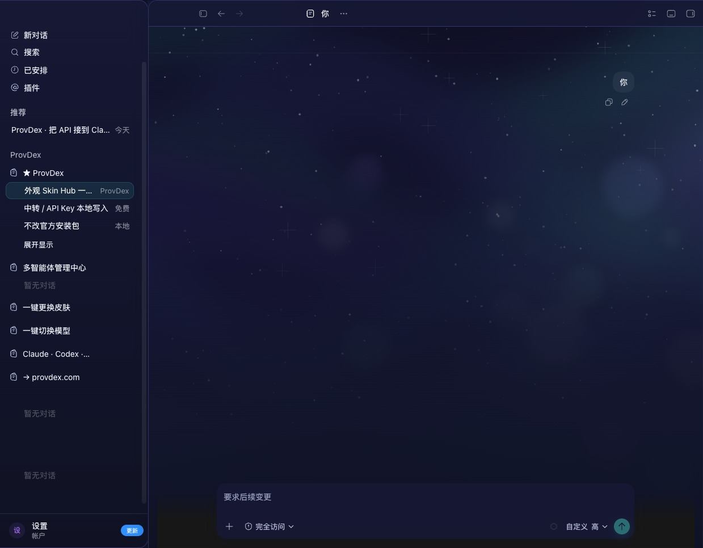
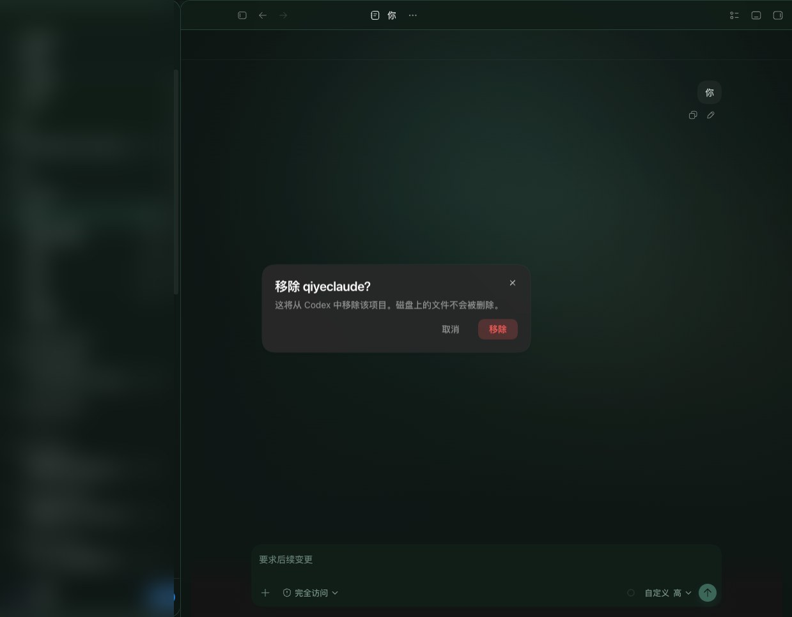

<p align="center">
  
</p>

<h1 align="center">agent-skin-hub</h1>

<p align="center">
  <strong>给 Codex 桌面端换一张会呼吸的脸。</strong><br/>
  一键皮肤 · 真机效果 · 按需下载 · 不把安装包撑爆
</p>

<p align="center">
  <a href="https://github.com/Chiody/agent-skin-hub/stargazers"></a>
  <a href="./catalog.json"></a>
  <a href="./LICENSE"></a>
</p>

<p align="center">
  <a href="#-先看真机效果"><b>真机截图</b></a> ·
  <a href="#-30-秒用上"><b>怎么用</b></a> ·
  <a href="#-皮肤库"><b>皮肤库</b></a> ·
  <a href="#-投稿你的皮肤"><b>投稿</b></a>
</p>

---

写代码已经够累了。  
**工作台，至少可以好看一点。**

`agent-skin-hub` 是 Codex Desktop 的开源皮肤合集：赛博霓虹、星河粉梦、雪峰清晨、深空矩阵……  
点一下，整窗氛围就换掉——侧栏、输入框还是原生可点，不是整张假截图糊上去。

> 非 OpenAI 官方。不改 `.app` / `app.asar`。  
> 皮肤托管在 GitHub，客户端按需下载，**你的 App 不会因为皮肤变胖。**

---

## ✨ 先看真机效果

下面全部是 **真实 Codex Desktop 窗口截图**（Dream Skin 注入后实拍）。  
侧栏项目名故意排成 ProvDex 一句话广告——从上往下读就行。

<p align="center">
  <br/>
  <sub>苍蓝矩阵 · 深空门户，写下一行代码也像在开飞船</sub>
</p>

<p align="center">
  <br/>
  <sub>雪景 · 冰蓝雪线，冷静、干净、专注</sub>
</p>

<p align="center">
  
  &nbsp;
  <br/>
  <sub>赛博霓虹 · 午夜极光</sub>
</p>

<p align="center">
  
  &nbsp;
  <br/>
  <sub>Ember Bloom · 樱粉晨曦</sub>
</p>

<p align="center">
  
  &nbsp;
  <br/>
  <sub>Aurora Veil · 森野薄雾</sub>
</p>

喜欢就 **Star** 一下——合集越大，皮肤越多。

---

## 🚀 30 秒用上

### 方式 A · ProvDex（推荐）

1. 打开 [ProvDex](https://provdex.com) → Codex → **外观**
2. 从 Skin Hub 选一套（会自动拉远程皮肤）
3. 点 **应用并打开 Codex**

官网合集页：[`provdex.com` Skin Hub](https://provdex.com/skinhub.html)（读本仓 `catalog.json`）

### 方式 B · Codex Dream Skin

已装 [Codex Dream Skin](https://github.com/Fei-Away/Codex-Dream-Skin) 时，把任意 `presets/preset-*` 拷进本机主题库即可切换：

```bash
# 例：装「星莓绮梦」
git clone --depth 1 https://github.com/Chiody/agent-skin-hub.git
cp -R agent-skin-hub/presets/preset-strawberry-starlight \
  "$HOME/Library/Application Support/CodexDreamSkinStudio/themes/"

~/.codex/codex-dream-skin-studio/scripts/switch-theme-macos.sh \
  --id preset-strawberry-starlight
```

---

## 🎨 皮肤库

| 皮肤 | 气质 | 预览 |
|------|------|------|
| 星莓绮梦 | 粉色星河，浪漫不降智 | [截图](docs/previews/preset-strawberry-starlight.jpg) |
| 苍蓝矩阵 | 深空门户，科幻任务台 | [截图](docs/previews/preset-azure-matrix.jpg) |
| 雪景 | 雪山冷光，专注模式 | [截图](docs/previews/preset-snow-scape.jpg) |
| 赛博霓虹 | 品红 × 电青 | [截图](docs/previews/preset-cyber-neon.jpg) |
| 午夜极光 | 深蓝极光带 | [截图](docs/previews/preset-midnight-aurora.jpg) |
| Aurora Veil | 极光薄纱 | [截图](docs/previews/preset-aurora-veil.jpg) |
| Ember Bloom | 暖光花瓣 | [截图](docs/previews/preset-ember-bloom.jpg) |
| 樱粉晨曦 | 柔粉清晨 | [截图](docs/previews/preset-sakura-dawn.jpg) |
| 森野薄雾 | 墨绿晨雾 | [截图](docs/previews/preset-forest-mist.jpg) |
| Open Portal | 抽象门户 | [截图](docs/previews/preset-open-portal.jpg) |
| Deep Space Mission Control | NASA 地球气辉 | — |
| 琥珀黄昏 | 暖琥珀暮色 | — |

完整机器可读目录：[`catalog.json`](./catalog.json)  
单套直链：

```text
https://raw.githubusercontent.com/Chiody/agent-skin-hub/main/presets/<id>/theme.json
https://raw.githubusercontent.com/Chiody/agent-skin-hub/main/presets/<id>/background.jpg
```

---

## 💌 投稿你的皮肤

欢迎 PR。合集靠大家一起变好看。

**能过审的包长这样：**

```text
presets/preset-your-slug/
  theme.json       # schemaVersion: 1，id 与目录名一致
  background.jpg   # 无侧栏/无输入框的纯背景（建议 16:9）
  SOURCE.md        # 来源、许可、作者
```

```bash
node scripts/validate-preset.mjs presets/preset-your-slug
node scripts/build-catalog.mjs
```

**请别投这些：** 游戏 IP / 未授权角色立绘 / 真人肖像 / 带 Codex UI 的假截图当背景 / 可执行脚本塞进皮肤包。

---

## 🛡️ 安全边界

- 只分发 **主题素材**（图 + `theme.json`），不含注入器病毒包
- 运行时换肤走本机 CDP 回环（Dream Skin / ProvDex），**不改官方安装包签名**
- 换肤与 API / 中转配置无关，不会偷偷改你的 Key

---

## ⭐ 如果这让你的 Codex 好看了一点

点一下右上角 **Star**，让更多人发现这片皮肤宇宙。  
也欢迎把你的实机截图发到 Issue —— 好看的我们会挂到 README。

<p align="center">
  
</p>

<p align="center">
  <sub>Make something wonderful — and make it look wonderful too.</sub>
</p>

## License

MIT。各皮肤素材以 `presets/*/SOURCE.md` 为准。
