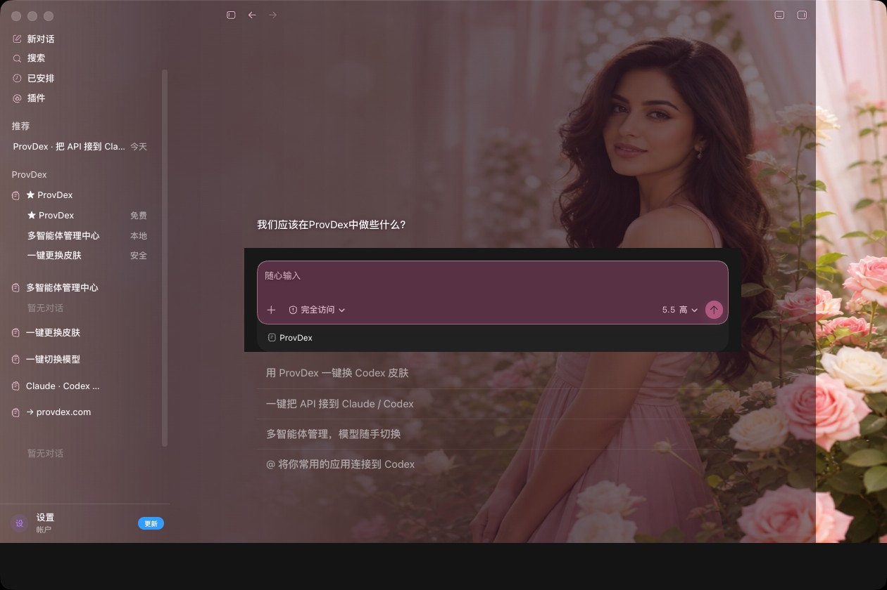
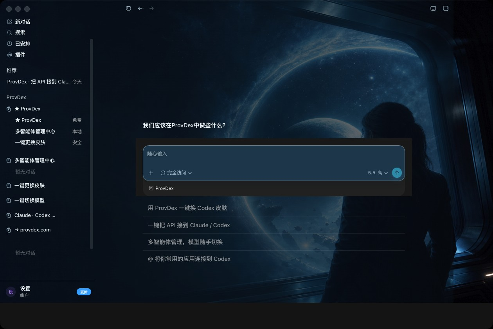
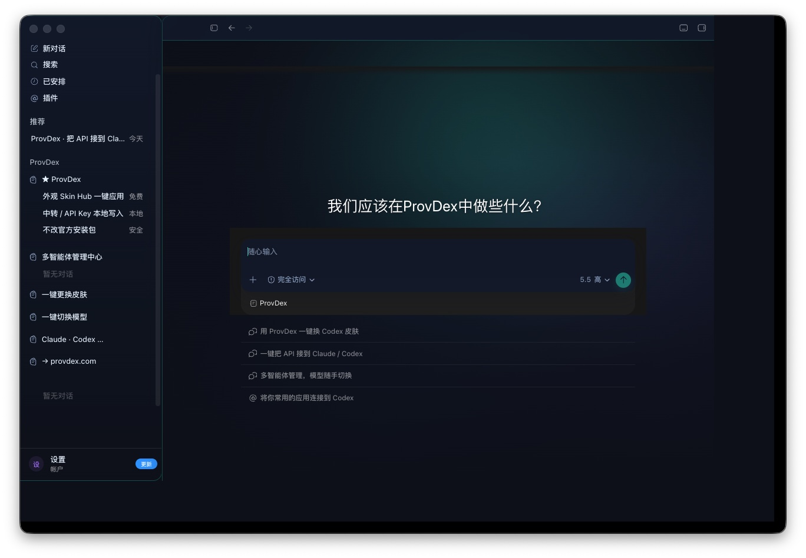
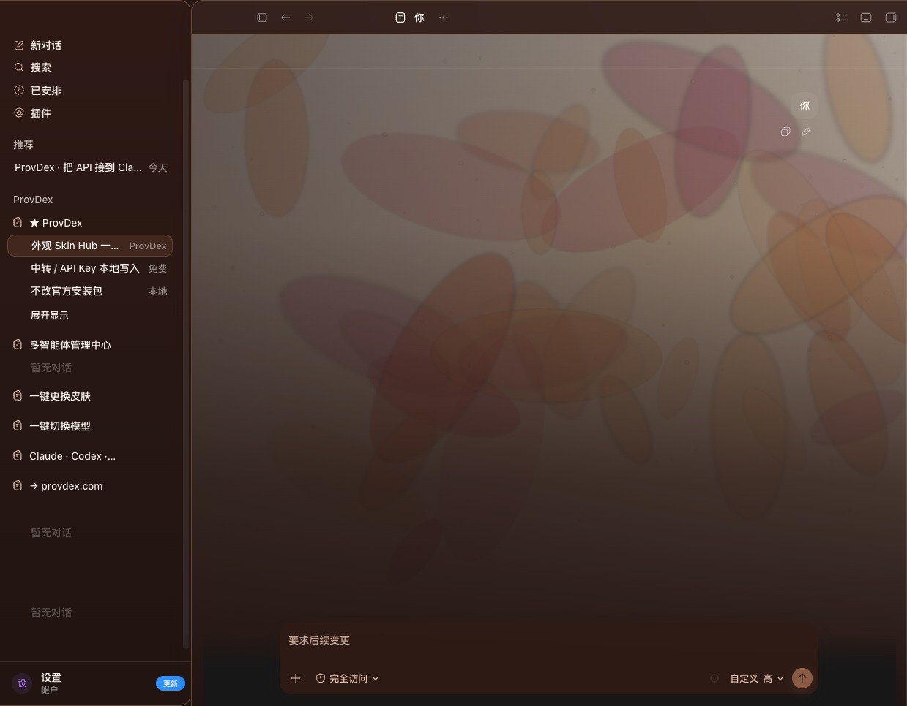
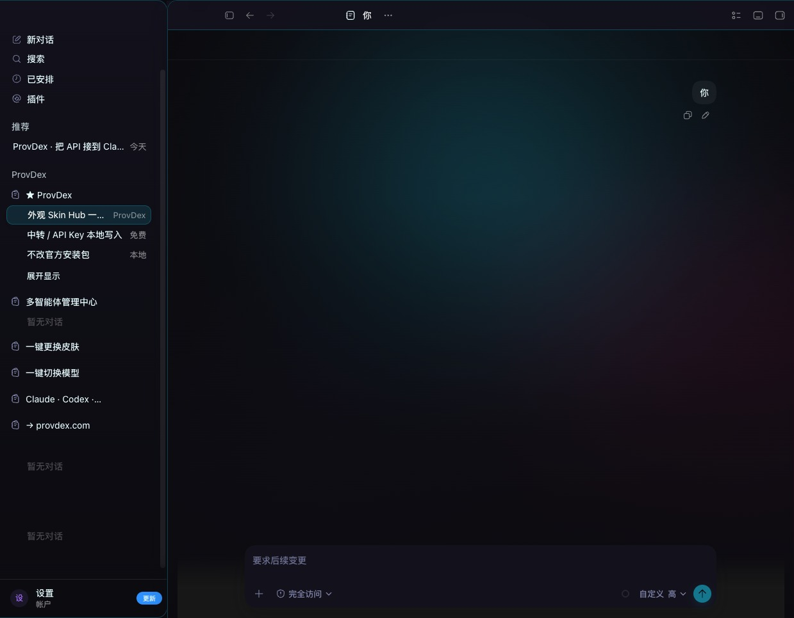
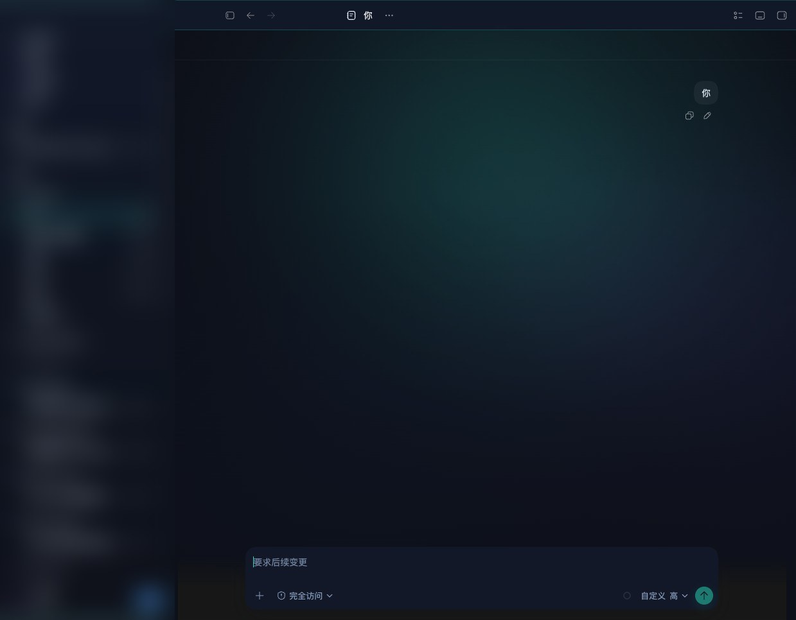

<p align="center">
  
</p>

<h1 align="center">agent-skin-hub</h1>

<p align="center">
  <strong>给 Codex 换一套好看的皮肤。</strong><br/>
  免费 · 开源 · 一键装上
</p>

<p align="center">
  <a href="https://github.com/Chiody/agent-skin-hub/stargazers"></a>
  <a href="./LICENSE"></a>
</p>

---

写代码已经够累了。工作台，至少可以好看一点。

这里是一堆给 **Codex 桌面端** 用的皮肤：粉星河、雪景、霓虹、暖光……喜欢哪套下哪套，不必塞进安装包里。

用 [ProvDex](https://provdex.com) 打开就能换，不用改 Codex 本体。

---

## 看看效果

<p align="center">
  <br/>
  <sub>苍蓝矩阵</sub>
</p>

<p align="center">
  <br/>
  <sub>雪景</sub>
</p>

<p align="center">
  
  &nbsp;
  <br/>
  <sub>Ember Bloom · 赛博霓虹</sub>
</p>

<p align="center">
  
  &nbsp;
  <br/>
  <sub>午夜极光 · 星莓绮梦</sub>
</p>

喜欢就点个 Star，合集越大皮肤越多。

---

## 怎么用

1. 打开 [ProvDex](https://provdex.com)
2. 进 Codex → **外观**
3. 挑一套，点应用

更多皮肤：[Skin Hub](https://provdex.com/skinhub.html)

> 侧栏里的 ProvDex 文案只是展示用，不是你自己的项目列表。

---

## 有哪些

| 名字 | 感觉 |
|------|------|
| 星莓绮梦 | 粉色星河 |
| 苍蓝矩阵 | 深空门户 |
| 雪景 | 安静冰蓝 |
| Ember Bloom | 暖光花瓣 |
| 赛博霓虹 | 品红电青 |
| 午夜极光 | 深蓝夜色 |
| 樱粉晨曦 / 森野薄雾 / 琥珀黄昏… | 更多在 `presets/` |

---

## 想投稿？

丢一个文件夹进来就行：

```text
presets/preset-your-slug/
  theme.json
  background.jpg   ← 纯背景图，别拿整页 UI 截图凑数
  SOURCE.md        ← 图片从哪来、能不能用
```

**别投这些：** 游戏角色、真人脸、别人的 IP、带侧栏输入框的假截图。

截图请拍 **刚打开的首页**（标题 + 壁纸那一页），不要拍聊到一半的对话页。

---

## 安全

- 这里只有图片和主题配置，没有可执行补丁
- 不碰你的 API Key
- 和 OpenAI 官方无关

---

## License

MIT。每套皮肤的素材说明看各自的 `SOURCE.md`。
