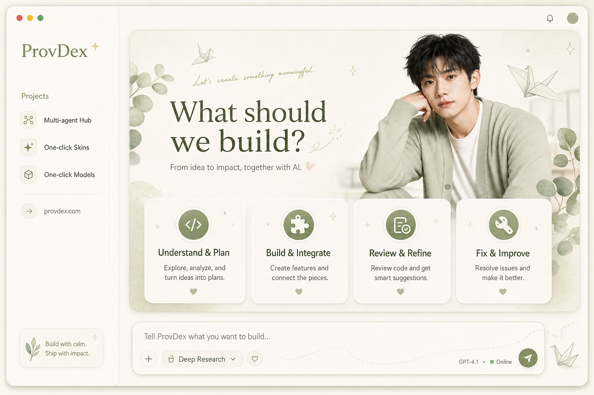
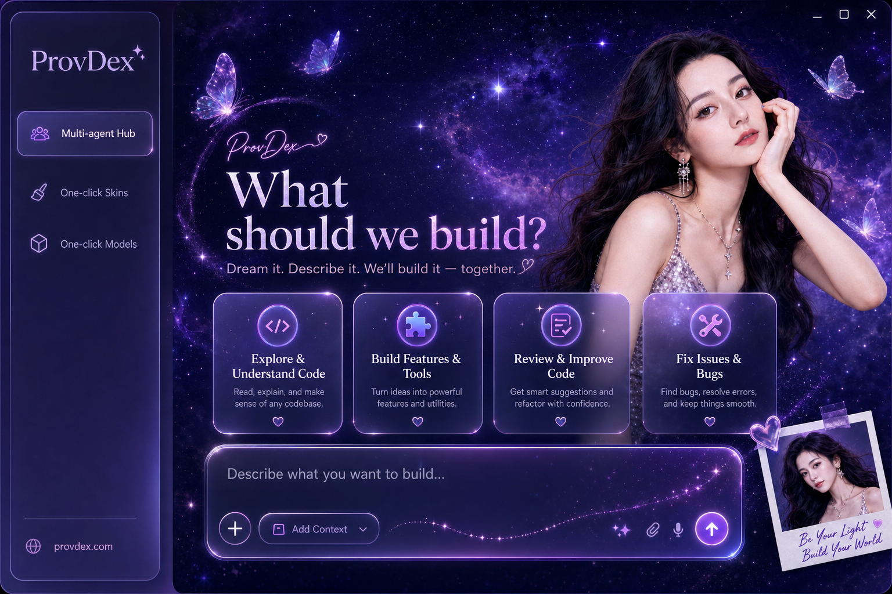
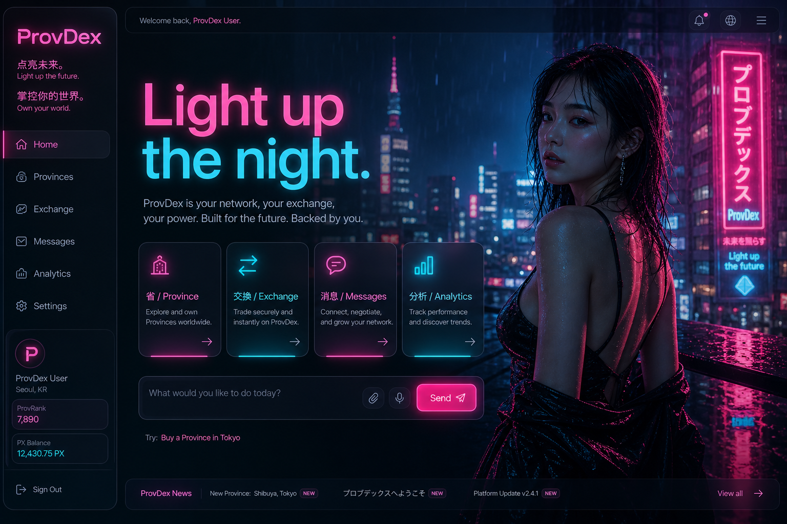
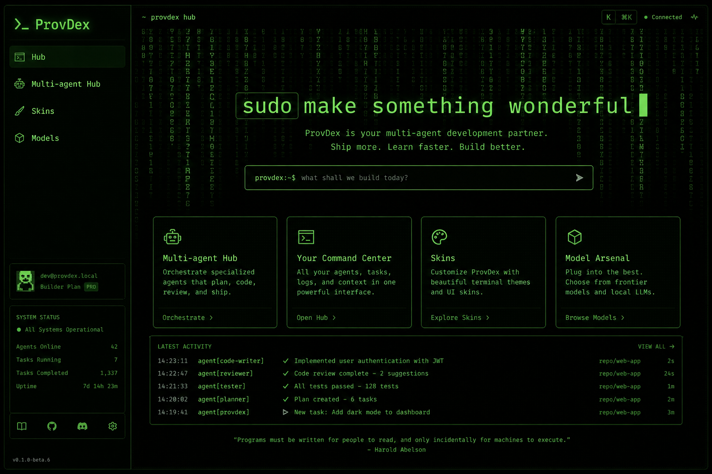
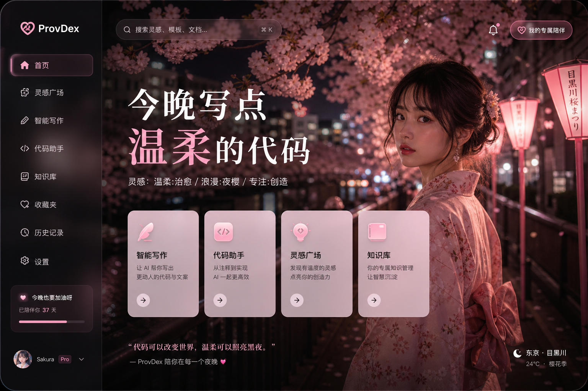
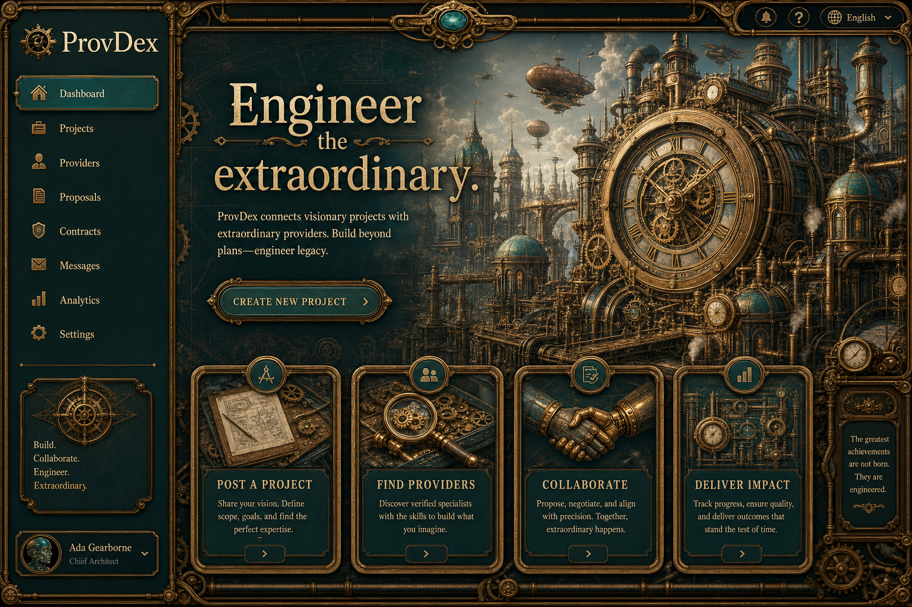
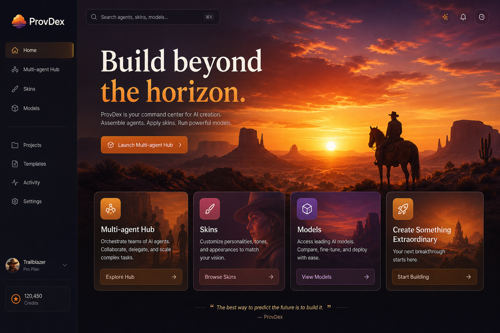
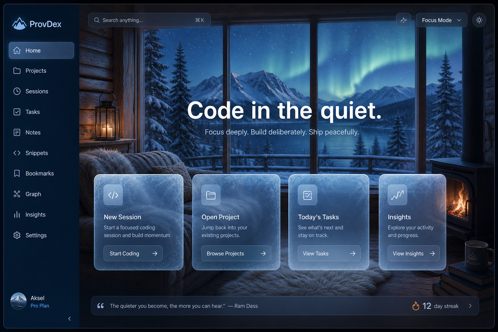
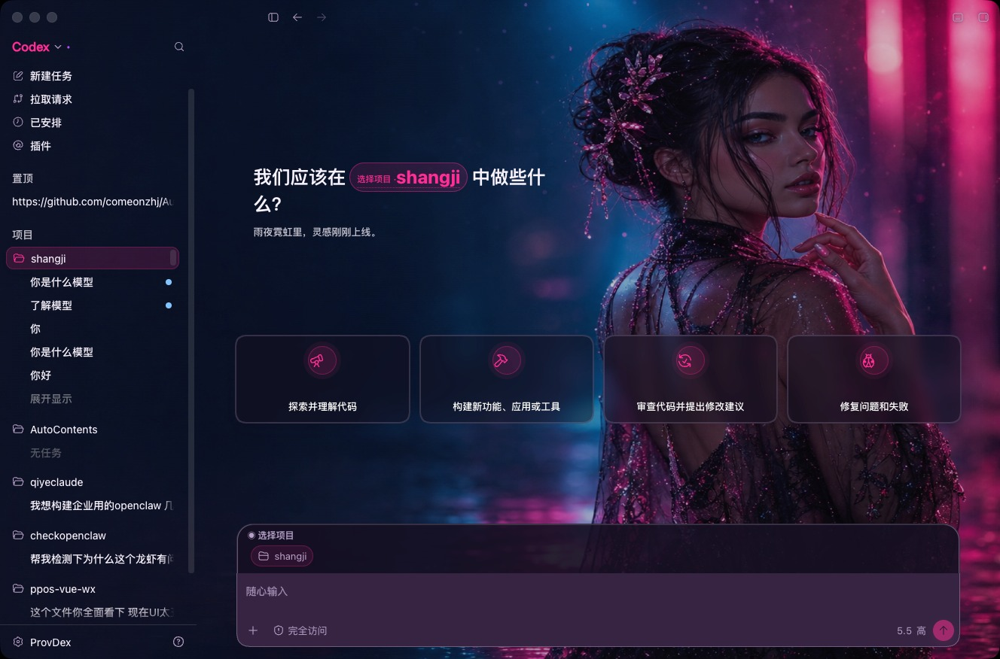

<p align="center">
  
</p>

<h1 align="center">agent-skin-hub</h1>

<p align="center">
  <strong>给 Codex 换一套好看的皮肤。</strong><br/>
  免费 · 开源 · 一键装上
</p>

<p align="center">
  <a href="https://github.com/Chiody/agent-skin-hub/stargazers"></a>
  <a href="./LICENSE"></a>
  <a href="https://provdex.com/skinhub.html"></a>
  <a href="./gallery.json"></a>
</p>

<p align="center">
  <a href="https://provdex.com">用 ProvDex 打开即换</a> ·
  <a href="./catalog.json">catalog.json</a> ·
  <a href="./gallery.json">gallery.json</a> ·
  <a href="./docs/ads/">概念广告图</a>
</p>

---

写代码已经够累了。工作台，至少可以好看一点。

| 资源 | 用途 | 路径 |
|------|------|------|
| **概念效果图** | 官网 / GitHub 画廊展示（整窗 UI 画在图里） | [`docs/ads/`](./docs/ads/) |
| **纯背景底图** | 真机可导入换肤 | [`presets/*/background.jpg`](./presets/) |
| **真机实拍** | 原生控件换色后的截图 | [`docs/previews/`](./docs/previews/) |
| **机器可读索引** | 前端按需拉取 URL | [`gallery.json`](./gallery.json) + [`catalog.json`](./catalog.json) |

> 概念图 ≠ 壁纸。导入请用 `presets/.../background.jpg`，不要拿 `docs/ads/*` 当背景。

---

## 概念画廊 · 对照仓 8 向

<table>
  <tr>
    <td width="50%"><br/><sub>01 · 柔光玫瑰</sub></td>
    <td width="50%"><br/><sub>02 · 财神打工</sub></td>
  </tr>
  <tr>
    <td><br/><sub>03 · 红白科幻</sub></td>
    <td><br/><sub>04 · 清透鼠尾草</sub></td>
  </tr>
  <tr>
    <td><br/><sub>05 · ENFP 小宇宙</sub></td>
    <td><br/><sub>06 · 紫夜星河</sub></td>
  </tr>
  <tr>
    <td><br/><sub>07 · 青蓝虚拟偶像</sub></td>
    <td><br/><sub>08 · 舞台黑金</sub></td>
  </tr>
</table>

---

## 概念画廊 · 海外 / 其他

<table>
  <tr>
    <td width="50%"><br/><sub>09 · Synthwave 80s</sub></td>
    <td width="50%"><br/><sub>10 · 北欧极简</sub></td>
  </tr>
  <tr>
    <td><br/><sub>11 · 赛博雨夜</sub></td>
    <td><br/><sub>12 · 海边编程</sub></td>
  </tr>
  <tr>
    <td><br/><sub>13 · 咖啡窝</sub></td>
    <td><br/><sub>14 · 黑客终端</sub></td>
  </tr>
  <tr>
    <td><br/><sub>15 · 樱花夜</sub></td>
    <td><br/><sub>16 · 蒸汽朋克</sub></td>
  </tr>
  <tr>
    <td><br/><sub>17 · 沙漠落日</sub></td>
    <td><br/><sub>18 · 雪屋静写</sub></td>
  </tr>
  <tr>
    <td><br/><sub>19 · 太空站</sub></td>
    <td><br/><sub>20 · Teal SaaS</sub></td>
  </tr>
</table>

完整文件名与分组说明 → [`docs/ads/README.md`](./docs/ads/README.md)

---

## 已配对：概念图 × 底图 × 真机实拍

部分概念主题已落成可安装皮肤（纯背景 + 真机四卡首页）：

<table>
  <tr>
    <th width="33%">概念效果</th>
    <th width="33%">可导入底图</th>
    <th width="33%">真机实拍</th>
  </tr>
  <tr>
    <td><br/><sub>柔光玫瑰</sub></td>
    <td><br/><sub><a href="./presets/preset-trial-rose-soft">preset-trial-rose-soft</a></sub></td>
    <td><br/><sub>原生建议卡</sub></td>
  </tr>
  <tr>
    <td><br/><sub>财神打工</sub></td>
    <td><br/><sub><a href="./presets/preset-trial-caishen">preset-trial-caishen</a></sub></td>
    <td><br/><sub>原生建议卡</sub></td>
  </tr>
  <tr>
    <td><br/><sub>赛博雨夜</sub></td>
    <td><br/><sub><a href="./presets/preset-trial-neon-rain">preset-trial-neon-rain</a></sub></td>
    <td><br/><sub>原生建议卡</sub></td>
  </tr>
</table>

其余配对状态见 [`gallery.json`](./gallery.json) 的 `wallpaper` / `livePreview` 字段。

---

## 怎么用

1. 打开 [ProvDex](https://provdex.com) → Codex → **外观**
2. 或浏览 [Skin Hub 官网页](https://provdex.com/skinhub.html)
3. 挑一套，点应用（按需从本仓下载，不塞进安装包）

开发者拉取：

```bash
# 可安装目录
curl -sL https://raw.githubusercontent.com/Chiody/agent-skin-hub/main/catalog.json | head

# 概念图 + 底图 + 实拍 URL
curl -sL https://raw.githubusercontent.com/Chiody/agent-skin-hub/main/gallery.json | head
```

---

## 还有哪些可安装皮肤

| 名字 | 底图 | 实拍 |
|------|------|------|
| 星莓绮梦 | [`presets/preset-strawberry-starlight`](./presets/preset-strawberry-starlight) | [preview](./docs/previews/preset-strawberry-starlight.jpg) |
| 苍蓝矩阵 | [`presets/preset-azure-matrix`](./presets/preset-azure-matrix) | [preview](./docs/previews/preset-azure-matrix.jpg) |
| Aurora Veil | [`presets/preset-aurora-veil`](./presets/preset-aurora-veil) | [preview](./docs/previews/preset-aurora-veil.jpg) |
| 雪景 | [`presets/preset-snow-scape`](./presets/preset-snow-scape) | [preview](./docs/previews/preset-snow-scape.jpg) |
| … | [`presets/`](./presets/) | [`docs/previews/`](./docs/previews/) |

完整目录：[`catalog.json`](./catalog.json)（含 `wallpaperUrl` / `previewUrl`）

---

## 想投稿？

```text
presets/preset-your-slug/
  theme.json
  background.jpg   ← 纯背景 16:9，别拿整页 UI 截图凑数
  SOURCE.md
```

**别投：** 游戏角色、真人明星脸、带侧栏输入框的假截图。

重建索引：

```bash
node scripts/build-catalog.mjs
node scripts/build-gallery.mjs
```

---

## License

MIT。每套皮肤看各自的 `SOURCE.md`。
